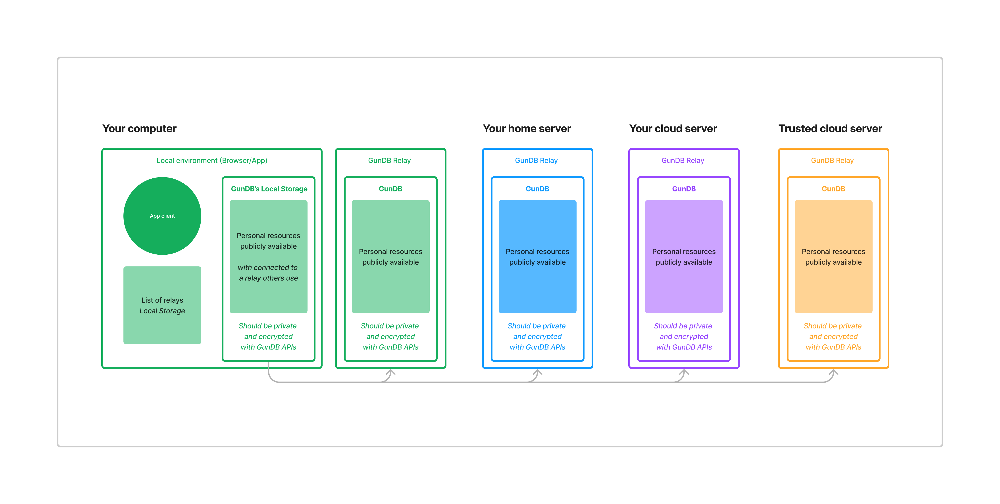

# GunDB with Node.js

This a production ready node.js GunDB relay server. Since GunDB is a realtime service the relay needs to be hosted on an always on server - Your local machine, home server, or a cloud provider like [Render.com](https://render.com).

## Local or home server instructions

1. Setup environment variables, copy the sample.env file to .env and set the desired port number

2. Install dependencies:

```sh
npm install
# or
yarn
```

3. Execute the following command. This will start the relay but will only keep it running while the terminal window is open. Use #4 instead of the script below to get it to persist.

```sh
yarn start
```

4. To get the relay to persist you can use [PM2](https://pm2.keymetrics.io/).
```sh
# install pm2 to your machine
npm install pm2 -g
# build the app
yarn build
# and then start the relay
pm2 start ./dist/index.js
```

5. Once it's running use the demo UI to test out adding a relay and storing data
- http://localhost:ENV_PORT#/app/index.html

## Cloud server instructions

1. [Fork this repo](https://github.com/130public/gundb-server-template/fork) to your own github account
    - This step is only helpful if you plan to make changes to the app

2. Set up a free account with Render.com

3. On the dashboard click "New +" and select "web service"

4. To deploy the service select "Build and deploy from a Git repository"

5. Use the "Public Git repository" if you didn't do #1 and add "https://github.com/130public/gundb-server-template"

6. Click "Next" and give your app a name (it'll be your app url), ignore the rest and scroll down and click "Create Web Service"

## Resources

- [This site](https://dev.to/tirthpatel/deploy-node-ts-express-typescript-on-vercel-284h) helped get vercel and typescript set up
- [Express sample for GunDB](https://github.com/amark/gun/blob/master/examples/express.js)

## What your app could look like

